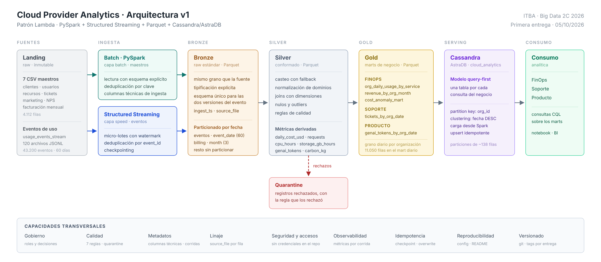

# Documento de Diseño v1 · Cloud Provider Analytics

**Primera entrega · 05/10/2026** · ITBA · Big Data 2C 2026

Documento de diseño de la primera evaluación. Las decisiones citadas (D1 a D12) están en
[`decisions.md`](decisions.md) y la evidencia medida, en
[`../evidence/profiling_landing.md`](../evidence/profiling_landing.md).

## 1. Interpretación del problema

### 1.1 Problema

El equipo actúa como área de datos de un proveedor de nube. Tres áreas de negocio —FinOps, Soporte
y Producto— necesitan analítica sobre los datos de sus clientes, pero las fuentes llegan crudas y
no son consultables de forma directa: siete maestros en CSV y un flujo de eventos de uso
fragmentado en 120 archivos JSONL, con nulos, tipos ambiguos, valores fuera de rango y un cambio
de esquema a mitad del histórico (la versión 2 incorpora `carbon_kg` y `genai_tokens`).

El problema es construir un pipeline que ingeste, limpie, conforme y publique esos datos con dos
capacidades complementarias:

| Capacidad | Datos | Necesidad que cubre |
|---|---|---|
| Near real-time | Eventos de uso (`usage_events_stream`) | Métricas operativas de uso, consumo y costo incremental |
| Batch diario o mensual | Maestros de CRM, tickets, encuestas y facturación | Dimensiones de referencia, soporte y revenue |

El resultado son marts analíticos en Parquet, publicados en Cassandra/AstraDB, que responden las
preguntas de cada área sin acceder a los datos crudos.

### 1.2 Usuarios

| Usuario | Qué necesita | Actualización | Fuentes |
|---|---|---|---|
| FinOps | Costos, consumo, revenue, créditos, impuestos y anomalías por organización y servicio | Costos de uso: near real-time · Revenue: mensual | `usage_events_stream`, `billing_monthly.csv`, `resources.csv`, `customers_orgs.csv` |
| Soporte | Volumen de tickets, severidad, cumplimiento de SLA y CSAT por organización y fecha | Diaria | `support_tickets.csv`, `customers_orgs.csv` |
| Producto / Usage | Uso de servicios, requests, métricas operativas, tokens GenAI y carbono | Near real-time | `usage_events_stream`, `resources.csv` |

`users.csv`, `marketing_touches.csv` y `nps_surveys.csv` se ingestan a Bronze como fuentes de
referencia; ninguna de las cinco consultas obligatorias depende de ellas.

### 1.3 Preguntas principales

Son las cinco consultas obligatorias de la consigna (§7.4). Cada una se responde desde una tabla
de serving propia (D8).

| # | Pregunta | Usuario | Fuente | Mart en Gold | Ingesta |
|---|---|---|---|---|---|
| P1 | ¿Cuánto costó y cuántos requests tuvo cada organización, por servicio y por día, en un rango de fechas? | FinOps | `usage_events_stream` | `org_daily_usage_by_service` | Streaming |
| P2 | ¿Cuáles son los N servicios de mayor costo acumulado de una organización en los últimos 14 días? | FinOps | `usage_events_stream` | `org_daily_usage_by_service` | Streaming |
| P3 | ¿Cómo evolucionaron los tickets críticos y la tasa de incumplimiento de SLA, por día, en los últimos 30 días? | Soporte | `support_tickets.csv` | `tickets_by_org_date` | Batch |
| P4 | ¿Cuál fue el revenue mensual de cada organización, con créditos e impuestos, normalizado a USD? | FinOps | `billing_monthly.csv` | `revenue_by_org_month` | Batch |
| P5 | ¿Cuántos tokens GenAI consumió cada organización por día y a qué costo estimado? | Producto | `usage_events_stream` (v2) | `genai_tokens_by_org_date` | Streaming |

Además, FinOps requiere identificar costos diarios anómalos por organización y servicio. Se resuelve
en Gold con `cost_anomaly_mart` (D9).

### 1.4 Objetivos medibles y criterios de éxito

El proyecto cumple su propósito cuando se alcanzan las siete metas siguientes. Las metas se
expresan sobre el dataset provisto; las cifras de referencia están medidas en
`evidence/profiling_landing.md`.

| # | Objetivo | Métrica | Meta | Verificación | Entrega |
|---|---|---|---|---|---|
| O1 | Responder las preguntas del negocio desde el serving | Preguntas P1–P5 respondidas en Cassandra/AstraDB leyendo una sola partición, sin `ALLOW FILTERING` | 5 de 5 | CQL y salida de cada consulta | 2.ª (P1 y P2) · final (P3 a P5) |
| O2 | Ingestar los eventos sin pérdida | Eventos de Landing presentes en Bronze | 43.200 de 43.200 | Conteo Landing contra Bronze | 2.ª |
| O3 | Ingestar los maestros sin pérdida | Filas de los 7 CSV presentes en Bronze | 4.112 de 4.112 | Conteo por fuente | 2.ª (3 maestros) · final (7) |
| O4 | No perder registros entre zonas | Fechas que cumplen `bronze = silver + quarantine` | 60 de 60 | Conteo por `event_date` (D10) | 2.ª |
| O5 | Aplicar las reglas de calidad | Reglas de D7 cuyo conteo de violaciones coincide con el medido en el perfilado | 7 de 7 | Conteo por regla en Silver y Quarantine | 2.ª (3 reglas) · final (7) |
| O6 | Reprocesar sin duplicar | Diferencia de filas por zona entre dos ejecuciones consecutivas · `event_id` duplicados | 0 · 0 | Conteos antes y después de re-ejecutar | 2.ª |
| O7 | Mantener las métricas de uso en near real-time | Micro-lotes hasta que un archivo de eventos queda disponible en Bronze | 1, con trigger de 10 s | Progreso de la consulta de streaming | 2.ª |

La trazabilidad de cada objetivo con el componente que lo cumple está en la parte D de
`matriz_requisito_componente.md`.

## 2. Justificación de Big Data · las 5V

El dataset provisto es una muestra de 12,6 MB y por sí solo no requiere Big Data. La necesidad
surge de la escala del caso real, que se proyecta como supuesto, y de que cada dimensión ya obliga
a tomar una decisión de arquitectura sobre la muestra.

| V | Hoy (medido) | A escala real (supuesto) | Decisión que lo responde |
|---|---|---|---|
| Volumen | 43.200 eventos · 4.112 filas maestras · 12,6 MB | 1 evento/recurso/minuto × 1 M recursos ⇒ ~1.440 M eventos/día ≈ 300 GB/día | Parquet columnar particionado (D3) |
| Velocidad | 120 micro-lotes de 360 eventos | Ingesta continua; FinOps necesita el costo del día en curso | Structured Streaming (D1, D6) |
| Variedad | JSONL con 2 esquemas + 7 CSV + `tags_json` anidado | Se suman logs, métricas de infra, telemetría | Esquema explícito unificado (D5) |
| Veracidad | 3,03 % tipos ambiguos · 4,72 % `unit` nulo · 100 % FX inconsistente en USD | Los mismos defectos en millones de filas | 7 reglas + Quarantine (D7) |
| Valor | 5 marts para 3 dominios | Alertas de sobrecosto, forecast, churn | Gold + serving Cassandra (D8) |

## 3. Inventario y perfil de fuentes

Perfil medido sobre el dataset completo con `notebooks/01_profiling_landing.ipynb`: 47.312 filas,
12,6 MB y 60 días de eventos (03/07/2025 a 31/08/2025).

### 3.1 Inventario

| Fuente | Grano | Filas | Columnas | Clave | Frecuencia |
|---|---|---|---|---|---|
| `usage_events_stream/*.jsonl` | 1 evento de uso | 43.200 en 120 archivos | 11 en v1 · hasta 13 en v2 | `event_id` | Continua, en micro-lotes |
| `customers_orgs.csv` | 1 organización | 80 | 11 | `org_id` | Batch diario |
| `users.csv` | 1 usuario | 800 | 7 | `user_id` | Batch diario |
| `resources.csv` | 1 recurso cloud | 400 | 7 | `resource_id` | Batch diario |
| `support_tickets.csv` | 1 ticket | 1.000 | 8 | `ticket_id` | Batch diario |
| `marketing_touches.csv` | 1 interacción de marketing | 1.500 | 7 | `touch_id` | Batch diario |
| `nps_surveys.csv` | 1 encuesta por organización y fecha | 92 | 4 | `org_id` + `survey_date` | Batch diario |
| `billing_monthly.csv` | 1 factura por organización y mes | 240 | 8 | `invoice_id` | Batch mensual |

**Tipos.** Los CSV no declaran tipos: se leen con esquema explícito y se tipifican en Bronze. Las
fechas vienen en formato ISO 8601 y los booleanos como texto (`True` / `False`). En los eventos,
`timestamp` está en ISO 8601 UTC y `value` llega con tres tipos: número (41.014), texto numérico
(1.309) y nulo (877).

### 3.2 Calidad y riesgos

| Fuente | Calidad medida | Tratamiento | Riesgo si no se trata |
|---|---|---|---|
| `usage_events_stream` | `value` como texto en 3,03 % · `unit` nulo con `value` presente en 4,72 % · 211 costos menores a −0,01 · dos versiones de esquema | D4, D5, D7 | Nulos silenciosos al tipar y métricas incompletas |
| `customers_orgs.csv` | `nps_score` nulo en 13,8 % y 1 valor fuera de rango (101) | D7 | NPS promedio distorsionado |
| `users.csv` | `last_login` nulo en 17,4 % | Se conserva nulo | Contiene `email`, un dato personal |
| `resources.csv` | `tags_json` nulo en 20,8 % | Se conserva nulo | Bajo |
| `support_tickets.csv` | `resolved_at` nulo en 24,0 % · `csat` nulo en 25,4 % y 40 valores fuera de [1,5] | D7; `resolved_at` nulo indica ticket abierto | CSAT promedio distorsionado |
| `marketing_touches.csv` | Sin nulos | — | Bajo |
| `nps_surveys.csv` | `nps_score` nulo en 20,7 % · `comment` nulo en 10,9 % | Se conservan nulos | Bajo |
| `billing_monthly.csv` | `credits` nulo en 57,1 % · 160 de 160 facturas en USD con tipo de cambio distinto de 1 · 13 subtotales negativos | D7; `credits` nulo se interpreta como 0; los subtotales negativos son notas de crédito y se conservan | Revenue distorsionado hasta ±15 % |

**Trazabilidad.** No hay claves primarias duplicadas en ninguna de las ocho fuentes. Las seis
fuentes que referencian organizaciones lo hacen por `org_id`, sin huérfanos. Los 400 `resource_id`
de los eventos existen en `resources.csv`, y ningún evento tiene `org_id`, `service` o `region`
distintos de los de su recurso. Desde Bronze, cada fila conserva `source_file` e `ingest_ts` (D11).

## 4. Arquitectura v1 y patrón elegido



Diagrama v1 del 05/10/2026. El fuente editable es `arquitectura_v1.svg`.

### 4.1 Patrón: Lambda (D1)

| Patrón | Evaluación para este caso | Resultado |
|---|---|---|
| Solo batch | No cubre el streaming de eventos que exige la consigna ni el costo incremental del día en curso | Descartado |
| Kappa | Obliga a convertir siete CSV estáticos en streams sintéticos; `billing_monthly` tiene tres cortes mensuales | Descartado |
| Híbrido | La definición de Lambda de la consigna (§4.3) ya describe esta separación; no hay una combinación adicional que justificar | No necesario |
| **Lambda** | Streaming para `usage_events_stream` y batch para los siete maestros; las dos ramas convergen en Bronze | **Elegido** |

El riesgo de Lambda es duplicar lógica entre las dos ramas. Se mitiga con funciones de conformance
únicas en `src/common/`, que importan los dos jobs.

### 4.2 Componentes y responsabilidades

| Capa | Herramienta | Responsabilidad | Decisión |
|---|---|---|---|
| Fuentes | Archivos CSV y JSONL en Landing | Dato crudo inmutable | D10 |
| Ingesta batch | PySpark 3.5 (`spark.read`) | Leer los siete maestros con esquema explícito, deduplicar por clave y agregar columnas técnicas | D2, D11 |
| Ingesta streaming | Structured Streaming | Leer los eventos en micro-lotes con watermark, deduplicación por `event_id` y checkpoint | D4, D5, D6 |
| Data Lake | Parquet sobre Google Drive | Zonas Bronze, Silver, Gold y Quarantine | D3, D10, D12 |
| Procesamiento | PySpark, API de DataFrames | Conformar, aplicar reglas de calidad, calcular métricas, anomalías y marts | D7, D9 |
| Serving | Cassandra / AstraDB | Una tabla por consulta, con `org_id` como partition key | D8 |
| Consumo | Consultas CQL desde notebook | Responder P1 a P5 para FinOps, Soporte y Producto | D8 |

El entorno es Google Colab con `master("local[*]")` (D2). La solución usa únicamente la API de
DataFrames, particionado explícito y Parquet, por lo que el mismo código corre distribuido en un
clúster sin reescribirse.

### 4.3 Capacidades transversales

| Capacidad | Cómo se implementa | Decisión |
|---|---|---|
| Gobierno | Áreas de responsabilidad por integrante (§10) y registro de decisiones versionado | — |
| Calidad | Siete reglas verificables; los registros rechazados van a Quarantine con la regla que los rechazó | D7 |
| Metadatos | Columnas técnicas por zona, esquemas explícitos y registro de corridas | D11 |
| Linaje | `source_file` por fila y registro de corridas por tabla | D11 |
| Seguridad y accesos | Configuración externalizada sin credenciales; token de AstraDB por variable de entorno; repositorio privado; el `email` de `users.csv` no se publica en Gold ni en serving | — |
| Observabilidad | Filas leídas, escritas y rechazadas y duración de cada corrida | D11 |
| Idempotencia | Checkpoints, `overwrite` dinámico por partición y anti-join contra Bronze | D6, D10 |
| Reproducibilidad | Dataset versionado, configuración de ejemplo y README con los pasos de ejecución | D10 |
| Versionado | Git, con un tag por entrega | — |

## 5. Diseño del Data Lake

### 5.1 Zonas y formatos

| Zona | Responsabilidad | Formato | Escritura |
|---|---|---|---|
| Landing | Archivos originales, inmutables | CSV y JSONL | Ninguna: solo lectura |
| Bronze | Mismo grano que la fuente, tipificación explícita, deduplicación y columnas técnicas | Parquet | `append` desde streaming · `overwrite` en maestros |
| Silver | Conformado: casteo, normalización, joins y reglas de calidad | Parquet | `overwrite` dinámico por partición |
| Gold | Marts de negocio por dominio | Parquet | `overwrite` dinámico por partición |
| Quarantine | Registros rechazados, con la regla que los rechazó | Parquet | `overwrite` dinámico por partición |

`_checkpoints/` y `_metadata/` quedan fuera de las zonas: guardan estado del motor y registro de
corridas, no datos (D10, D11). Parquet es el formato intermedio que fija la consigna y el
preferido para analítica por ser columnar (clase 03).

### 5.2 Particionamiento (D3)

Los eventos se particionan por `event_date` y `billing_monthly` por `month`. El resto de los
maestros no se particiona y se escribe con `coalesce(1)`.

| Esquema | Particiones | Filas/partición | Tamaño/archivo |
|---|---|---|---|
| Sin partición | 1 | 43.200 | ~1,5 MB |
| **Por `event_date`** | **60** | **~720** | **~28 KB** |
| Por `event_date` × `service` | 360 | ~120 | ~5 KB |
| Por `event_date` × `service` × `region` | 2.520 | ~17 | <1 KB |

Particionar por servicio multiplica por seis la cantidad de archivos sin ganar poda: las cinco
consultas obligatorias filtran por organización y fecha, y ninguna por servicio solo. Tampoco se
particiona por `org_id` (4.800 particiones de 9 filas): `org_id` es la clave de partición en
Cassandra (D8), no en el lago. Los archivos resultantes son chicos frente a un bloque HDFS de
128 MB; se acepta ese costo a cambio de poda temporal y se compacta Bronze con un job posterior.

### 5.3 Naming (D12)

| Elemento | Convención | Ejemplo |
|---|---|---|
| Ruta | `<zona>/<tabla>/<columna>=<valor>/` | `bronze/usage_events_stream/event_date=2025-07-03/` |
| Tabla en Bronze | Nombre de la fuente, sin extensión | `bronze/billing_monthly/` |
| Tabla en Silver | Entidad conformada; prefijo `dim_` para dimensiones | `silver/usage_events/`, `silver/dim_org/` |
| Tabla en Gold | Nombre del mart de la consigna (D10) | `gold/org_daily_usage_by_service/` |
| Tabla en Quarantine | Tabla de origen, particionada por regla | `quarantine/usage_events_stream/dq_rule=value_not_castable/` |
| Columna | Sufijo según el tipo de dato: `_ts`, `_date`, `_usd`, `_raw` | `ingest_ts`, `event_date`, `daily_cost_usd`, `exchange_rate_raw` |

### 5.4 Retención (D12)

| Zona | Retención | Justificación |
|---|---|---|
| Landing | Indefinida | Es inmutable (consigna §4.2) y la única copia desde la que se reconstruyen las demás zonas |
| Bronze | 13 meses | Se regenera desde Landing; 13 meses permiten comparar un mes con el mismo mes del año anterior sin reingestar |
| Silver | 13 meses | Se regenera desde Bronze; mismo horizonte que Bronze para que el reproceso de una fecha sea siempre posible |
| Gold | Indefinida | Es agregado y chico (11.050 filas en el mart diario para 60 días) y contiene el histórico de revenue |
| Quarantine | 90 días | Plazo para revisar el rechazo, corregir la regla o la fuente y reprocesar |
| `_checkpoints/` | Mientras exista la consulta de streaming | Borrarlo hace que el stream vuelva a leer Landing desde el inicio; solo se borra en un reproceso completo |
| `_metadata/` | Indefinida | Una línea por corrida; su tamaño es despreciable |

La retención se aplica borrando particiones completas por `event_date`, sin reescribir archivos. Se
define para la operación a escala real: el dataset provisto cubre 60 días y ninguna política llega
a aplicarse sobre él.

### 5.5 Metadatos (D11)

Los metadatos se registran en tres niveles: columnas técnicas por registro, esquemas explícitos
versionados en el repositorio y un registro de corridas en `_metadata/runs/`. No se usa metastore:
las tablas se referencian por ruta.

| Zona | Columnas técnicas | Qué permiten |
|---|---|---|
| Landing | Ninguna: los archivos no se modifican | El nombre y la ruta del archivo son el metadato |
| Bronze | `ingest_ts`, `source_file` | Saber cuándo y desde qué archivo entró cada fila |
| Silver | Las de Bronze y `dq_flags` | Conservar el origen y saber qué reglas de D7 marcaron la fila |
| Quarantine | Las de Bronze, `dq_rule` y `rejected_ts` | Saber qué regla rechazó cada fila y cuándo |
| Gold | `processed_ts` | Saber cuándo se calculó cada fila del mart |

### 5.6 Reglas de promoción (D10)

| Promoción | Condición | Verificación |
|---|---|---|
| Landing → Bronze | Esquema explícito aplicado y clave sin duplicados | Conteo de Landing igual al de Bronze (O2, O3) |
| Bronze → Silver | Reglas de D7 aplicadas; los registros bloqueados van a Quarantine | `bronze[d] = silver[d] + quarantine[d]` para cada fecha (O4) |
| Silver → Gold | La fecha está completa en Silver | La igualdad anterior se cumple para esa fecha |
| Gold → Cassandra | El mart de la fecha está escrito en Gold | Upsert por clave primaria; re-ejecutar no duplica (O6) |

La promoción escribe con `overwrite` por partición (`partitionOverwriteMode=dynamic`), lo que
permite reprocesar una fecha sin borrar el histórico.

## 6. Flujos batch y streaming

### 6.1 Flujo batch · maestros y facturación

| Paso | Operación | Herramienta | Salida |
|---|---|---|---|
| 1 · Lectura | Los siete CSV de Landing, con `StructType` explícito y sin `inferSchema` | `spark.read.csv` | DataFrame tipado |
| 2 · Bronze | Deduplicación por clave primaria; columnas `ingest_ts` y `source_file`; `coalesce(1)`, y `billing_monthly` particionado por `month` | PySpark · Parquet | `bronze/<fuente>/` |
| 3 · Silver | Casteo de números y fechas; reglas de D7 (tipo de cambio de USD a 1, `csat` y `nps_score` fuera de rango); `credits` nulo como 0 | PySpark · Parquet | `silver/` |
| 4 · Gold | `revenue_by_org_month` y `tickets_by_org_date` | PySpark · Parquet | `gold/<mart>/` |
| 5 · Serving | Carga con upsert por clave primaria | Conector de Cassandra para Spark | Tablas de D8 |

### 6.2 Flujo streaming · eventos de uso

| Paso | Operación | Herramienta | Salida |
|---|---|---|---|
| 1 · Lectura | Los 120 JSONL, con un esquema explícito único para v1 y v2 y `value` como texto; cinco archivos por micro-lote y trigger de 10 s | `spark.readStream` | Stream tipado |
| 2 · Deduplicación | Watermark de 60 días sobre `event_ts` y `dropDuplicatesWithinWatermark("event_id")` | Structured Streaming | Stream sin duplicados |
| 3 · Bronze | Escritura particionada por `event_date`, con `ingest_ts` y `source_file`, y checkpoint en `_checkpoints/` | Structured Streaming · Parquet | `bronze/usage_events_stream/` |
| 4 · Silver | `try_cast` de `value`; imputación de `unit` según `metric`; banderas de D7; join con las dimensiones de recurso y organización | PySpark · Parquet | `silver/usage_events/` |
| 5 · Gold | `org_daily_usage_by_service`, `genai_tokens_by_org_date` y `cost_anomaly_mart` (MAD, D9) | PySpark · Parquet | `gold/<mart>/` |
| 6 · Serving | Carga con upsert por clave primaria | Conector de Cassandra para Spark | Tablas de D8 |

`event_ts` es el campo `timestamp` de la fuente, tipado; de él se deriva `event_date`. La rama de
streaming termina en Bronze: la promoción a Silver y Gold se ejecuta por partición de fecha, sobre
las fechas que recibieron eventos, con las reglas de §5.6.

### 6.3 Watermark y datos tardíos (D6)

El dataset no está ordenado por tiempo: cada archivo contiene los 60 días mezclados. En el primer
micro-lote ya aparece un evento del 31/08 y el watermark avanza hasta el máximo. Simulación con
micro-lotes de cinco archivos:

| Watermark | Eventos descartados |
|---|---|
| 1 día | **94,2 %** |
| 2 días | **92,7 %** |
| 7 días | 84,7 % |
| 30 días | 47,9 % |
| **60 días** | **0 %** |

Un watermark de 2 días descarta el 93 % de los eventos sin excepción ni registro en el log. Se fija
en 60 días, con lo que no se descarta ninguno. La idempotencia no depende del watermark: se apoya en
el checkpoint y en un anti-join contra Bronze. A escala real, 60 días de estado no son viables; el
histórico se cargaría por batch y el stream en vivo usaría un watermark de minutos, que es la
separación que permite Lambda.

### 6.4 Evolución de esquema (D5)

| Versión | Período | Eventos | Campos |
|---|---|---|---|
| v1 | 03/07/2025 a 17/07/2025 | 10.800 | 11 campos base |
| v2 | 18/07/2025 a 31/08/2025 | 32.400 | Los de v1, `carbon_kg` y, en el servicio `genai`, `genai_tokens` |

Las dos versiones conviven en una sola tabla de Bronze con el esquema de v2: los eventos v1 llevan
`carbon_kg` y `genai_tokens` en nulo y se conserva `schema_version` como columna. El corte es limpio,
sin solapamiento. `genai_tokens` aparece en 3.132 de los 4.158 eventos de `genai`, por lo que el
mart `genai_tokens_by_org_date` no tiene datos anteriores al 18/07.

### 6.5 Reglas de calidad (D7)

`BLOQUEA` envía el registro a Quarantine; `MARCA` lo deja pasar con una bandera en `dq_flags`.

| Regla | Acción | Violaciones medidas |
|---|---|---|
| `event_id` no nulo y único | BLOQUEA | 0 (43.200 únicos) |
| `cost_usd_increment >= -0.01` | MARCA | 211 / 43.200 (0,49 %) |
| `unit` no nulo si hay `value` | MARCA e imputa | 2.038 (4,72 %) |
| `value` casteable a double | BLOQUEA si falla | 0 fallan |
| `currency='USD'` ⇒ `fx = 1.0` | CORRIGE | **160 / 160 filas USD** |
| `csat ∈ [1,5]` | MARCA y anula | 40 / 746 (0.0×11, 6.0×28, 7.0×1) |
| `nps_score ∈ [-100,100]` | MARCA y anula | 1 (valor 101.0) |

### 6.6 Serving query-first (D8)

| Consulta (§7.4) | Tabla | Partition key | Clustering key |
|---|---|---|---|
| 1 · Costos y requests diarios | `org_daily_usage_by_service` | `(org_id)` | `usage_date DESC, service` |
| 2 · Top-N servicios, 14 días | `org_service_cost_14d` | `(org_id)` | `total_cost_usd DESC, service` |
| 3 · Tickets críticos y SLA | `tickets_by_org_date` | `(org_id)` | `date DESC, severity` |
| 4 · Revenue mensual en USD | `revenue_by_org_month` | `(org_id)` | `month DESC` |
| 5 · Tokens GenAI por día | `genai_tokens_by_org_date` | `(org_id)` | `date DESC` |

`org_id` es la partition key de todas las tablas porque las cinco consultas filtran por
organización: cada consulta lee una sola partición. El Top-N tiene una tabla propia porque
Cassandra no ordena por una columna agregada; el total se calcula en Spark y se escribe como
clustering key descendente.

## 7. Lógica MapReduce del flujo batch

Se expresa el mart `org_daily_usage_by_service` como job MapReduce canónico.

**Map** — por cada evento de Silver:
```
clave = (org_id, event_date, service)
valor = (cost_usd_increment,
         value si metric = "requests"         else 0,
         value si metric = "cpu_hours"        else 0,
         value si metric = "storage_gb_hours" else 0,
         genai_tokens ?? 0,
         carbon_kg    ?? 0,
         1)                                    # contador
```
Un `value` nulo aporta 0 a la suma.

**Combiner** — suma componente a componente dentro de cada mapper. Válido porque todas las
métricas son sumas, y la suma es asociativa y conmutativa.

**Shuffle** — agrupa por `(org_id, event_date, service)`. 80 × 60 × 6 = 28.800 claves posibles, de las que el dataset
materializa 11.050.

**Reduce** — suma los vectores parciales y emite una fila del mart:
```
(org_id, usage_date, service, daily_cost_usd, requests,
 cpu_hours, storage_gb_hours, genai_tokens, carbon_kg, event_count)
```

**Equivalencia en Spark:**
```python
def metric_sum(metric):
    return F.sum(F.when(F.col("metric") == metric, F.col("value_num")).otherwise(0))

mart = (silver_events
   .groupBy("org_id", "event_date", "service")
   .agg(F.sum("cost_usd_increment").alias("daily_cost_usd"),
        metric_sum("requests").alias("requests"),
        metric_sum("cpu_hours").alias("cpu_hours"),
        metric_sum("storage_gb_hours").alias("storage_gb_hours"),
        F.sum(F.coalesce("genai_tokens", F.lit(0))).alias("genai_tokens"),
        F.sum(F.coalesce("carbon_kg", F.lit(0.0))).alias("carbon_kg"),
        F.count("*").alias("event_count"))
   .withColumnRenamed("event_date", "usage_date"))
```

**Correspondencia:** el `groupBy().agg()` equivale a este MapReduce. El `groupBy` define la clave
del shuffle, el `agg` es el reduce, y Spark aplica agregación parcial en el mapper, que cumple el
rol del combiner. La diferencia (clase 03, p. 45) es que MapReduce escribe el resultado de cada
trabajo en HDFS con replicación, mientras Spark mantiene los resultados intermedios en memoria y
encadena las transformaciones en un DAG con evaluación perezosa. El plan físico de Spark muestra
la misma estructura: un `HashAggregate` con sumas parciales, un `Exchange hashpartitioning` por la
clave y un `HashAggregate` final.

**Sobre el skew:** no hay riesgo. La clave más pesada tiene 15 eventos y la mediana es 3, así que
ninguna partición domina el tiempo total.

## 8. Matriz requisito-componente

La matriz está en [`matriz_requisito_componente.md`](matriz_requisito_componente.md) y tiene cuatro
partes:

| Parte | Relación que traza |
|---|---|
| A | Preguntas del negocio (P1 a P5) → mart en Gold y tabla en Cassandra |
| B | Requisitos técnicos de la consigna (§4.4) → componente, zona y decisión |
| C | Las 5V → decisión de arquitectura que responde a cada una |
| D | Objetivos medibles (O1 a O7) → componente y decisión que los cumplen |

## 9. Supuestos, riesgos y decisiones abiertas

### 9.1 Supuestos

| # | Supuesto | Si no se cumple |
|---|---|---|
| 1 | El dataset no cambia entre hoy y el 07/12 | Re-correr el notebook de perfilado y revisar D4, D6 y D7, que dependen de cifras medidas |
| 2 | `credits` nulo en `billing_monthly` significa cero, no "desconocido" | Cambia el cálculo de revenue de la consulta 4 |
| 3 | Los tickets sin `resolved_at` están abiertos, no perdidos | Cambia la tasa de resolución y el mart de Soporte |
| 4 | Los tipos de cambio de ARS (~0,0015) son reales y no errores de carga | Corregirlos inflaría el revenue argentino por ~650 |
| 5 | Los `resource_id` de los eventos siempre existen en `resources.csv` | Hoy se cumple (400 de 400); igual se implementa un left join con marca de huérfano |
| 6 | La proyección de volumen de las 5V es ilustrativa, no una medición | Se declara como supuesto en el documento; no sostiene ninguna decisión por sí sola |

### 9.2 Riesgos y mitigaciones

| # | Riesgo | Prob. | Impacto | Mitigación |
|---|---|---|---|---|
| R1 | Un watermark corto descarta el 93 % de los eventos, sin error ni log | Alta | Crítico | D6: watermark de 60 días, con la simulación documentada |
| R2 | El esfuerzo del equipo se desvía hacia la implementación y el documento de diseño queda incompleto | Media | Crítico | Esta entrega es de diseño; la implementación es alcance de la 2.ª |
| R3 | `value` declarado como `DoubleType` pierde el 3,03 % de los datos en silencio | Alta | Alto | D4: leer como string en Bronze y castear en Silver |
| R4 | El revenue queda distorsionado ±15 % por el tipo de cambio de las facturas en USD | Alta | Alto | D7: forzar el FX a 1,0 para USD, conservando el original |
| R5 | El diagrama deja de coincidir con lo que dice el documento | Media | Alto | Control cruzado antes de congelar; el diagrama se actualiza junto con el texto |
| R6 | Colab se desconecta y se pierde el trabajo | Media | Medio | D2: el Data Lake vive en Drive, no en el disco de Colab |
| R7 | Límites del tier gratuito de AstraDB en la segunda entrega | Baja | Medio | Probar la conexión antes del 16/11; Cassandra en contenedor como plan B |
| R8 | Los archivos Parquet quedan demasiado chicos y degradan la lectura | Media | Bajo | D3: no particionar por servicio; compactar Bronze |

R1, R3 y R4 se detectaron midiendo el dataset y están documentados con su cifra en `decisions.md`.

### 9.3 Decisiones abiertas

Decisiones no tomadas a la fecha de la entrega, con su fecha límite y la opción preferida.

| Pregunta | Se decide antes de | Inclinación |
|---|---|---|
| ¿AstraDB o Cassandra en Docker? | 16/11 | AstraDB, por la modalidad remota |
| ¿El componente de ML es anomalías o churn? | 16/11 | Anomalías: reutiliza D9 y alimenta un mart ya pedido |
| ¿SCD tipo 2 en `dim_org`? | 16/11 | No: el dataset no trae historia de cambios de plan |
| ¿Herramienta de visualización? | 07/12 | Notebook con matplotlib |
| ¿Airflow o notebook secuencial? | 07/12 | Secuencial: Airflow en Colab es overhead sin beneficio |

## 10. Estimación de esfuerzo y recursos

El detalle está en [`plan_inicial.md`](plan_inicial.md).

### 10.1 Roles

| Área | De qué responde | Artefacto principal |
|---|---|---|
| Arquitectura | Patrón, diagrama, capacidades transversales, matriz | `arquitectura_v1.svg`, `matriz_requisito_componente.md` |
| Datos y calidad | Inventario, perfil de fuentes, reglas de calidad, diccionario | `evidence/profiling_landing.md`, §3 del diseño |
| Data Lake | Zonas, particionamiento, naming, retención, metadatos, promoción | §5 del diseño |
| Procesamiento | Flujos batch y streaming, esquemas explícitos, lógica MapReduce | §§6 y 7 del diseño |
| Documento y repo | Estructura, README, convenciones, redacción e integración final | `diseno_v1.md`, este plan |

### 10.2 Esfuerzo

El esfuerzo se estima en tallas relativas y no en horas. **Alto**: varias sesiones, con discusión
de equipo. **Medio**: una o dos sesiones. **Bajo**: una sesión. La tabla cubre los bloques de la primera
entrega; los de las entregas siguientes están en §10.4.

| Bloque de trabajo | Esfuerzo |
|---|---|
| Lectura de la consigna y del material de clase | Medio |
| Perfilado del dataset y validación de hallazgos | Medio |
| Decisiones de arquitectura y diseño del Data Lake | **Alto** |
| Diagrama de arquitectura v1 | Medio |
| Matriz de trazabilidad | Medio |
| Interpretación del problema, usuarios y objetivos | Bajo |
| Metadatos de las zonas del Data Lake | Bajo |
| Flujos batch y streaming, y lógica MapReduce | Medio |
| Redacción e integración del documento de diseño | **Alto** |
| Revisión contra el checklist y ensayo de defensa | Bajo |

### 10.3 Recursos

| Recurso | Para qué | Costo | Estado |
|---|---|---|---|
| Google Colab | Ejecución de PySpark en `local[*]` | gratuito | disponible |
| Google Drive | Data Lake persistente entre sesiones de Colab | gratuito | disponible |
| GitHub | Repositorio versionado, privado, con el docente invitado | gratuito | creado |
| AstraDB | Serving en Cassandra (2.ª entrega) | tier gratuito | a validar antes del 16/11 |
| PySpark 3.5.x | Motor de procesamiento | — | fijado en D2 |

No hay costos de infraestructura: todo el alcance del proyecto entra en los tiers gratuitos.

### 10.4 Próximos pasos

Bloques de trabajo posteriores a esta entrega, con la instancia en la que se evalúan y su esfuerzo
estimado. El alcance sale de la consigna (§5.6, §6.2 y §7.2).

| # | Bloque de trabajo | Entrega | Esfuerzo | Componente o referencia |
|---|---|---|---|---|
| 1 | Plan de correcciones a partir del feedback: prioridad, responsable, fecha objetivo y evidencia esperada | Posterior a la 1.ª | Bajo | Consigna §5.6 |
| 2 | Validar la conexión con AstraDB y cerrar la decisión de serving | 2.ª · 16/11 | Bajo | R7 · decisiones abiertas |
| 3 | Ingesta batch de al menos tres maestros a Bronze | 2.ª · 16/11 | Medio | `src/ingest/batch_masters.py` |
| 4 | Ingesta streaming de eventos a Bronze, con watermark, deduplicación y checkpoint | 2.ª · 16/11 | **Alto** | `src/ingest/stream_events.py` |
| 5 | Silver de eventos y de al menos un maestro, con joins y tres features | 2.ª · 16/11 | **Alto** | `src/silver/conform_events.py`, `src/silver/features.py` |
| 6 | Reglas de calidad y Quarantine con muestras | 2.ª · 16/11 | Medio | `src/quality/rules.py` |
| 7 | Mart `org_daily_usage_by_service` en Gold | 2.ª · 16/11 | Medio | `src/gold/marts.py` |
| 8 | Keyspace, tabla query-first, carga desde Spark y dos consultas CQL | 2.ª · 16/11 | Medio | `src/serving/load_astra.py` |
| 9 | Componente analítico; la opción preferida es anomalías de costo | 2.ª · 16/11 | Medio | `src/gold/anomalies.py` · D9 |
| 10 | Demostración de idempotencia, pruebas, Quickstart y evidencias de ejecución | 2.ª · 16/11 | Medio | `tests/`, `evidence/`, README |
| 11 | Gobierno preliminar y backlog final priorizado | 2.ª · 16/11 | Bajo | Consigna §6.2 |
| 12 | Maestros restantes en Bronze y Silver | Final · 07/12 | Medio | `src/ingest/batch_masters.py` |
| 13 | Marts restantes y sus tablas de serving, para responder P3 a P5 | Final · 07/12 | **Alto** | `src/gold/marts.py`, `src/serving/load_astra.py` |
| 14 | Gobierno, linaje, seguridad y observabilidad completos; diccionario de datos | Final · 07/12 | Medio | D11 |
| 15 | Presentación ejecutiva, video y defensa oral | Final · 07/12 | Medio | Consigna §7.5 |
